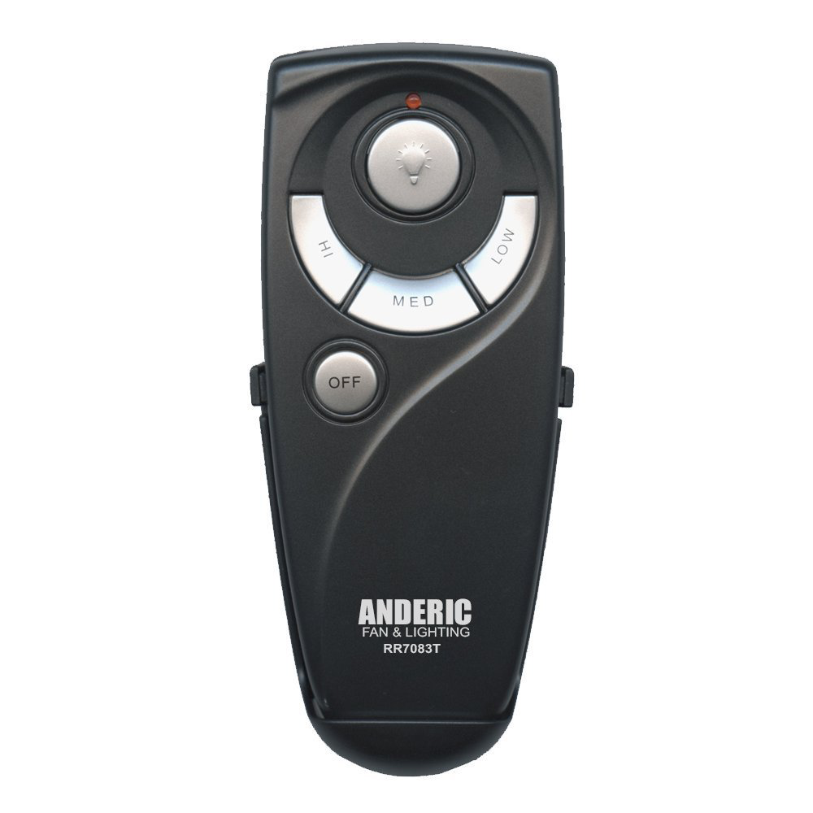
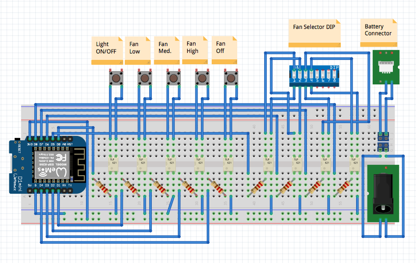

# fan-controller-api

API Endpoint for Fan Remote Controller




## Parts

* ($5.99) PCB Mount Screw Terminal Blocks: <http://a.co/jd3RjUB>
* ($7.89) Optocoupler PC817C DIP-4: <http://a.co/bq2HAgH>
* ($19.95) Hampton Bay UC7083T Ceiling Fan Remote Control: <http://a.co/2tVAojX>
* ($3.50)  WEMOS D1 mini (ESP8266) Choose one:
	* v3.0.0 ($3.50): [aliexpress wemos](https://www.aliexpress.com/store/product/D1-mini-Mini-NodeMcu-4M-bytes-Lua-WIFI-Internet-of-Things-development-board-based-ESP8266/1331105_32529101036.html?spm=2114.12010608.0.0.7a2e719fKwc0Az)
	* v1 ($2.69) [aliexpress wemos](https://www.aliexpress.com/item/ESP8266-ESP12-ESP-12-WeMos-D1-Mini-WIFI-Dev-Kit-Development-Board-NodeMCU-Lua/32653918483.html?spm=2114.search0104.3.2.6a801ed5nPwD8c&ws_ab_test=searchweb0_0,searchweb201602_1_10152_10151_10065_10344_10130_10068_10324_10342_10547_10325_10343_10546_10340_10548_10341_10545_10084_10083_10618_10630_10307_10313_10059_10534_100031_10103_10627_10626_10624_10623_10622_10621_10620_10142,searchweb201603_25,ppcSwitch_5&algo_expid=4779d5af-12ca-44c9-bd20-c7c6f4e0208d-0&algo_pvid=4779d5af-12ca-44c9-bd20-c7c6f4e0208d&transAbTest=ae803_5&priceBeautifyAB=0)

Total: $37.33 + cost of wiring/breadboards, etc.

## Arduino/ESP8266 WeMos

### Required Libraries

* aREST: <https://github.com/marcoschwartz/aREST>
* ESP8266: <https://github.com/esp8266/Arduino>

## Circuit Diagram



## API

```
$ curl http://<wemos-ip>/livingroom?params=0 | python -m json.tool
{
    "connected": true,
    "hardware": "esp8266",
    "id": "6",
    "name": "hbfans",
    "return_value": 1
}
```

## Resources

* WeMos D1R2 Pinout: <https://wiki.wemos.cc/products:d1:d1>
